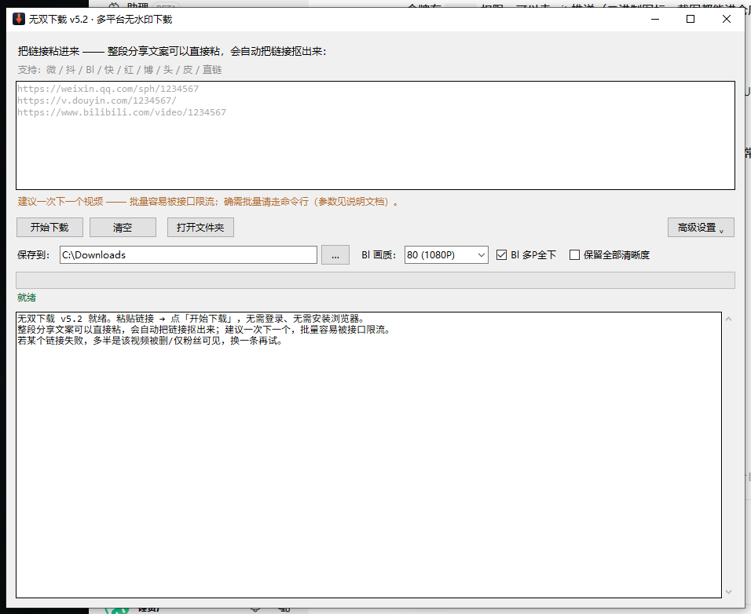
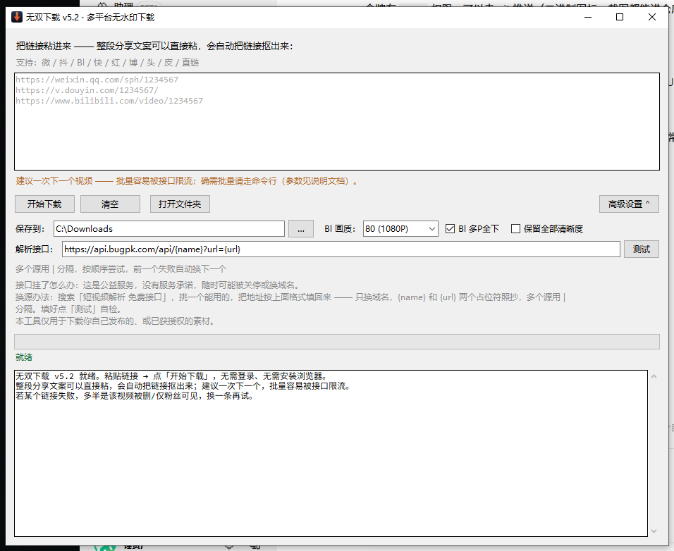

# 无双下载

单文件、零依赖的短视频与图文下载器（Windows）。复制链接 → 粘贴 → 下载。

不需要登录任何账号，不装浏览器插件，不装根证书，不要管理员权限。

> **使用前提**：只能下载你自己发布的、或已获得授权的视频。搬运他人作品违反平台规则，也可能侵犯著作权。本项目不提供任何绕过授权的能力。

## 下载

到 [**Releases**](https://github.com/chuiziyao/wushuang-download/releases) 下载 `wushuang-download-v5.2-win64.exe`，双击即用，**不需要安装 Python**。

想自己改代码或自行打包，见下方「[从源码运行 / 自行打包](#从源码运行--自行打包)」。

## 特点

- **单文件绿色版**：一个约 12 MB 的 exe，双击即用，不写注册表、不留后台服务
- **零第三方依赖**：源码 `wushuang_dl.py` 只用 Python 标准库，不依赖 requests、不依赖 ffmpeg、不需要浏览器
- **支持平台**（沿用程序内的代号写法）：`微` / `抖` / `Bl` / `快` / `红` / `博` / `头` / `皮` / `直链`
- **画质可选**：`Bl` 走官方接口，支持 4K / 1080P60 / 1080P 等清晰度，多 P 可一次性全下
- **整段文案直接粘**：分享文案里夹带的文字、表情、跟踪参数都能自动识别，只把链接抠出来
- **接口多源容错**：解析源支持配多个，用 `|` 分隔，前一个失败自动切下一个；界面里可随时替换
- **命令行模式**：同一份代码既出图形界面也能脚本化批量调用

## 界面

默认界面：



展开「高级设置」后可以检测并替换解析接口：



## 使用

### 图形界面

1. 双击 `无双下载.exe`
2. 把链接粘进输入框；整段分享文案直接粘也行
3. 点「开始下载」
4. 跑完自动打开保存目录（默认 `C:\Downloads\`，可在界面上改）

默认目录不存在会自动创建。若系统盘受限建不了，程序会退回 `~\Downloads\短视频`，并把界面上的路径同步刷新，不会出现「显示一个路径、实际存到另一个」。

> **建议一次只下一个视频。** 这不是速度问题，是接口问题——这类公开解析服务本身有频率限制，连续请求反而更容易失败。确需批量请走命令行分批跑，中间留几秒间隔。

### 命令行

```bash
无双下载.exe 链接                    # 下载到默认目录
无双下载.exe 链接 -o D:\视频          # 指定保存目录
无双下载.exe 链接 -q 1080            # Bl 画质（80 / 64 / 32 / 16）
无双下载.exe 链接 --first-part       # Bl 只下第 1 个分 P
无双下载.exe 链接 --all-quality      # Bl 列出所有可用清晰度
无双下载.exe 链接 --api "模板"        # 临时指定解析源，支持 | 分隔
无双下载.exe -h                      # 查看帮助
```

用源码运行时把 `无双下载.exe` 换成 `python wushuang_dl.py` 即可，参数完全一致。

## 它是怎么工作的

分享链接是**加密的页面地址**，不是文件地址——直接请求拿回来的是网页源码。所以中间必须有一步「换票」：

```
分享链接  →  解析接口  →  真实 MP4 直链  →  本地文件
```

第 2 步由公开解析接口完成，程序自己不做这件事（那需要登录态和平台签名算法）。请求形如：

```
GET https://<接口域名>/api/{name}?url=<已编码的分享链接>
→ {"code":200,"data":{"url":"https://.../stodownload?...","title":"..."}}
```

程序拿到 `data.url` 后**自己直连平台服务器下载**。视频数据不经过接口方，接口只负责递一张票。

`Bl` 是例外，直接调官方接口，比走解析源更稳。

## 解析接口

默认走第三方公益接口，地址在源码第 47 行：

```python
API_TEMPLATE = 'https://api.bugpk.com/api/{name}?url={url}'
```

**接口坏了怎么办**：这是公益服务，没有服务承诺，随时可能关停或换域名。换源办法——搜索「短视频解析 免费接口」，挑一个能用的，按下述格式填回来：

```
https://新域名/api/{name}?url={url}|https://备用域名/api/{name}?url={url}
```

**只换域名，`{name}` 和 `{url}` 两个占位符照抄。** 多个源用 `|` 分隔，按顺序尝试。填好点「测试」自检——程序会逐个探测每个源是否还活着。

没有做接口自动更新，因为「哪个公益接口还能用」本身需要人工判断，做不到无人工介入；把地址开放成可编辑输入框，是为了接口失效时你能自救，而不必等新版程序。

**代价要说清楚**：

| 项 | 说明 |
|---|---|
| 隐私 | 你要下载的链接会经过第三方服务器（对方能看出你下了什么，但拿不到视频内容） |
| 稳定性 | 单点依赖，接口方随时可能停止服务 |
| 时效 | `微` 的直链约 24 小时过期，过期重新取链接即可 |
| 速度 | 下载本身不限速，但接口方若限流会拖慢「换票」这一步 |

## 从源码运行 / 自行打包

要求 Python 3.9+，图形界面需要 `tkinter`（Windows 官方安装包自带）。

```bash
python wushuang_dl.py            # 图形界面
python wushuang_dl.py 链接 -o D:\视频   # 命令行
```

打包成单文件 exe：

```bash
pip install pyinstaller pillow
python -m PyInstaller --onefile --noconsole --clean --name 无双下载 \
  --icon assets/wushuang.ico --add-data "assets/wushuang.ico;." \
  --version-file tools/version_info.txt wushuang_dl.py
```

产物在 `dist/无双下载.exe`。

## 项目结构

```
wushuang_dl.py              主程序（单文件，零第三方依赖）
tools/
  version_info.txt          exe 版本信息资源
  gen_logo.py               按脚本生成全套图标（13 种尺寸 + ico + svg + 字标）
  extract_exe_icon.py       自带 PE 资源解析器，校验 exe 内嵌图标
  make_shortcut.py          ctypes 直调 Shell API 创建桌面快捷方式
  ui_check.py               源码态界面自检并截图
  exe_check.py              打包态自检：启动 → 认主窗口 → PrintWindow 截图 → 杀进程树
  ph_check.py               输入框占位符逻辑断言（防止占位示例被当成真实任务提交）
assets/
  wushuang.ico              应用图标（11 种尺寸）
  wushuang.svg / png/       设计稿与各尺寸导出
docs/                       界面截图
```

## 常见问题

**报「直链多半已过期」**
程序校验了下载内容的文件头（MP4 的 `ftyp` 魔数）。拿到的是网页或错误页而不是视频，说明接口返回的直链已经失效——`微` 的链接约 24 小时过期，重新取一条分享链接再试。

**解析失败，但链接我能正常打开**
大概率是解析接口挂了或换了地址。展开「高级设置」点「测试」，按上面的换源办法换一个。

**批量下载越下越失败**
接口限流。改成一次一个，或在命令行分批跑并加间隔。

**为什么窗口标题不写平台全称**
工具本身会公开分发，页面上直接罗列平台名容易被判定为搬运工具。本项目统一用代号写法，功能不受影响。

## 许可

MIT License，见 [LICENSE](LICENSE)。

## 免责声明

本项目仅供技术学习与个人备份使用。请仅下载你本人发布、或已获得明确授权的内容。使用者因不当使用产生的一切后果由使用者自行承担，与作者无关。解析接口为第三方公益服务，本项目不对其可用性、稳定性与数据行为作任何担保。
